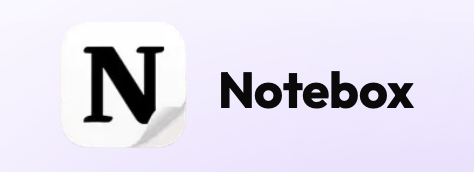
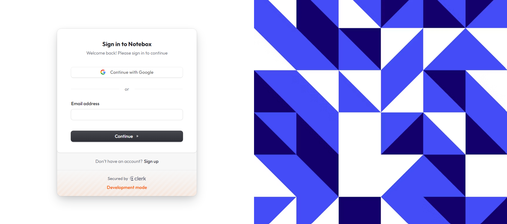
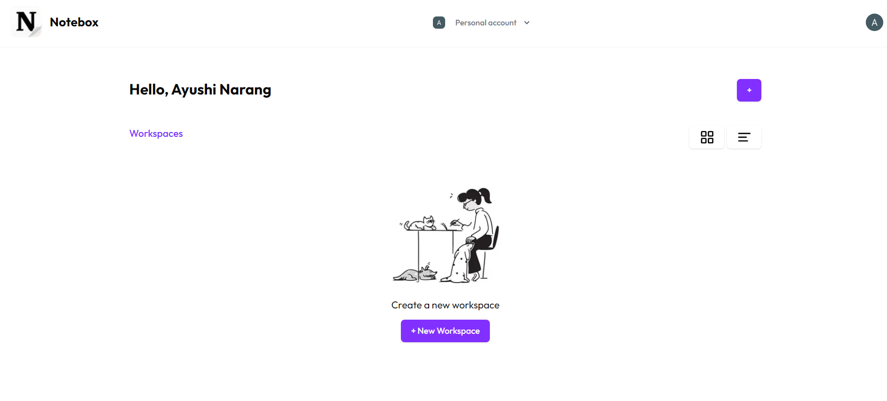
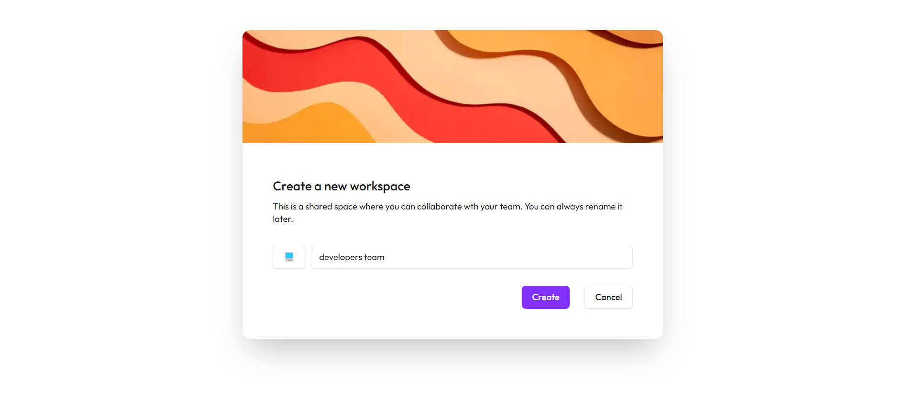
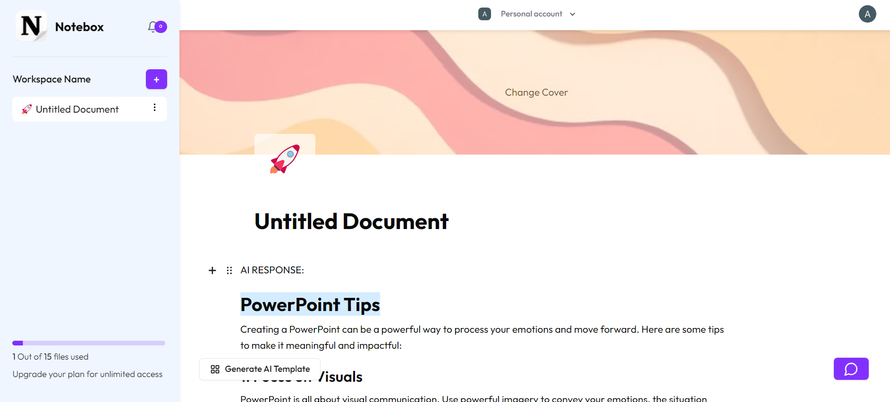
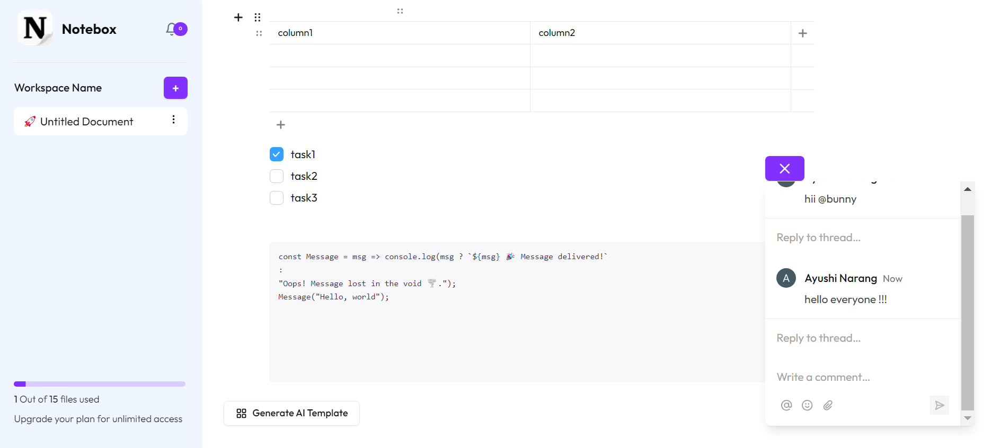

  

# Notebox – Note-Taking Application

> Notebox is a modern, feature-rich note-taking application designed to enhance productivity and creativity. Whether you’re organizing personal notes or brainstorming ideas, Notebox provides an intuitive and user-friendly platform to manage all your notes efficiently.

**Live Demo:** [Notebox](https://notebox-mu.vercel.app/)

**Tech Stack:**

  
  
  
  
  
  

## Features

### One-Click Sign In with Clerk
Notebox leverages Clerk for fast and secure authentication. Sign in with just one click and get instant access to your dashboard where you can manage and create notes effortlessly.

**Screenshot:**

---

### Custom Workspaces
After signing in, users can create personalized workspaces, assigning each a unique cover image, name, and emoji. Organize workspaces by projects, categories, or any method that suits your workflow.

**Screenshots:**

---

### AI-Powered Content Generation
Integrated AI, powered by Google Gemini, allows users to generate content effortlessly. Simply provide a prompt, and AI will craft a response automatically added to your document.

**Screenshot:**

---

### Rich Text Editor Powered by EditorJS
Each workspace contains documents where users can take detailed notes using EditorJS. Enjoy powerful rich text formatting, including:

- Headings to structure content
- Tables for organizing data
- Bullet points
- Code snippets for developers
- Image embedding

**Screenshot:**

---

### Collaboration and Communication
Users can tag and comment on documents. By tagging other users in the database, discussions within workspaces become seamless. Notifications, powered by Liveblocks, ensure real-time updates.

---

### Responsive Design
Optimized for all devices including mobile, tablet, and desktop for a seamless experience.

https://github.com/user-attachments/assets/76c8b7cd-5e9a-4049-8e19-8b113dc8e950

---

## Technologies Used

| Category           | Tech Stack            |
|-------------------|----------------------|
| Frontend         | Next.js               |
| Backend         | Firebase               |
| Authentication   | Clerk                  |
| Text Editor     | EditorJS               |
| AI Integration  | Google Gemini          |
| Collaboration   | Liveblocks             |

---

## ⭐ **Like This Project? Support & Connect!**
If you find this project useful, don’t forget to **⭐ Star** the repo!

More about me:  
💻 **Portfolio:** [@ayunarang](https://ayushinarang.vercel.app) 
🔗 **LinkedIn:** [@ayushinarang](https://linkedin.com/in/ayushinarang)  

