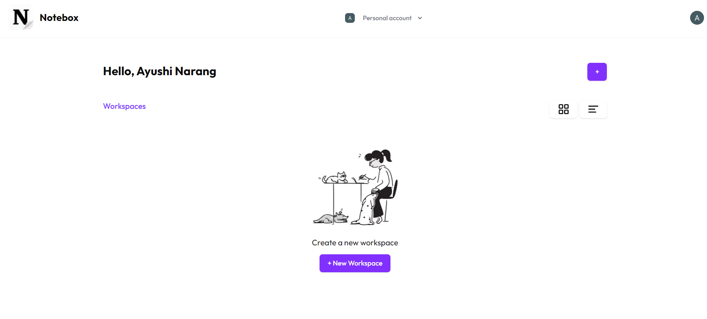

## Notebox 🚀

Notebox is a modern, feature-rich note-taking application designed to enhance your productivity and creativity. Whether you’re organizing personal notes  or brainstorming ideas, Notebox provides an intuitive and user-friendly platform that allows you to manage all your notes efficiently With a sleek interface, responsive design, and powerful tools.

## Features ✨

1. One-Click Sign In with Clerk
Notebox leverages Clerk for fast and secure authentication. Sign in with just one click and get instant access to your dashboard where you can manage and create your notes effortlessly.

3. Custom Workspaces
After signing in, users can create personalized workspaces, giving each workspace a unique cover image, name, and emoji. Organize your workspaces by projects, categories, or any method that suits your workflow.

4. AI-Powered Content Generation
Notebox comes with an integrated AI feature, powered by Google Gemini, that allows you to generate content effortlessly. Simply provide a prompt, and the AI will craft a response that is automatically added to your document, helping you brainstorm ideas, expand on concepts, or generate creative content.

6. Rich Text Editor Powered by EditorJS
Each workspace contains documents where you can take detailed notes using EditorJS. Enjoy powerful rich text formatting features including:

- Headings to structure your content.
- Tables for organizing data.
- Bullet points and numbered lists to keep track of tasks or ideas.
- Code snippets for developers.
- Images to illustrate your notes visually.

6. Collaboration and Communication
Notebox allows users to tag and comment on documents. By tagging other users in the database, you can easily start discussions within your workspace. Notifications, powered by Liveblocks, ensure real-time comments.

7. Responsive Design
Notebox is very responsive across devices.

https://github.com/user-attachments/assets/76c8b7cd-5e9a-4049-8e19-8b113dc8e950

## Technologies Used 🚀

- Next.js: For building a fast, scalable, and responsive front end.
- Firebase: For real-time database and backend services.
- Clerk: For secure, simple user authentication.
- EditorJS: For rich text formatting and seamless content creation.
- Google Gemini: For AI-powered content generation.
- Liveblocks: For real-time collaboration and notifications.

## Demo 🎨

notebox-mu.vercel.app/
